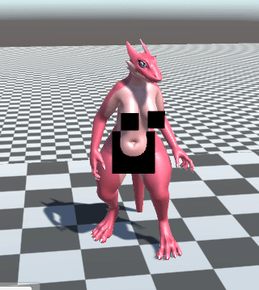
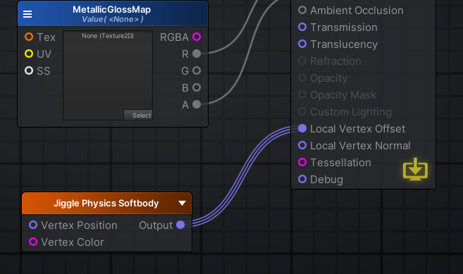
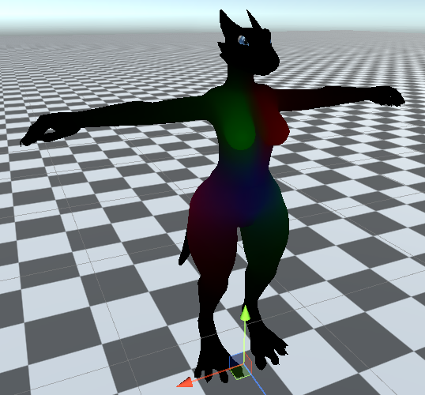
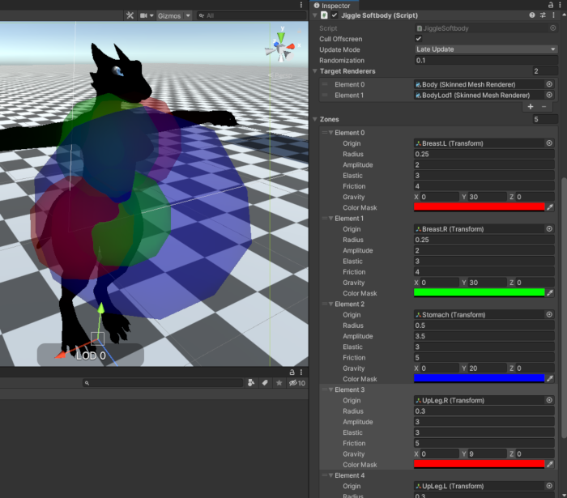

# Unity Jiggle Physics

An acceleration-based jigglebone system with soft-body/squash-and-stretch physics for SkinnedMeshRenderers in Unity.

## Features

* GPU per-vertex deformations via shader, squash/stretch based on vertex color masks.


* Purely acceleration based, elevators don't cause things to float/sag.



* Works at all framerates with very little differences in the physics solve. (It's unhooked from a fixed timestep as well!)

* Can run on LateUpdate, FixedUpdate, and Update.

* Only runs when mesh is visible.

* Comes with a JiggleSurfaceApproximator which can keep a transform attached to the "skin" of a mesh. Great for censorbars and attachments that can't be added directly to the mesh.

## Usage

1. Use the included AmplifyShader node to add the vertex deformations to whatever shader you want. (URP, HDRP, Standard, whatever!).



2. Make sure your model has RGBA vertex-color masks for how bouncy parts of the model is, keep individual neighboring bouncing parts as different colors.



3. Set up a JiggleSoftbody with sensors overlapped in such a way that each "individual" bouncy part has its own sensor.



4. Add JiggleBones for the primary movement.

## Installation

Simply add `https://github.com/naelstrof/UnityJigglePhysics.git#upm` as a package using the package manager.

Or if that doesn't work, add it to the manifest.json like so.

```
{
  "dependencies": {
    "com.naelstrof.jigglephysics": "https://github.com/naelstrof/UnityJigglePhysics.git#upm",
  }
}
```